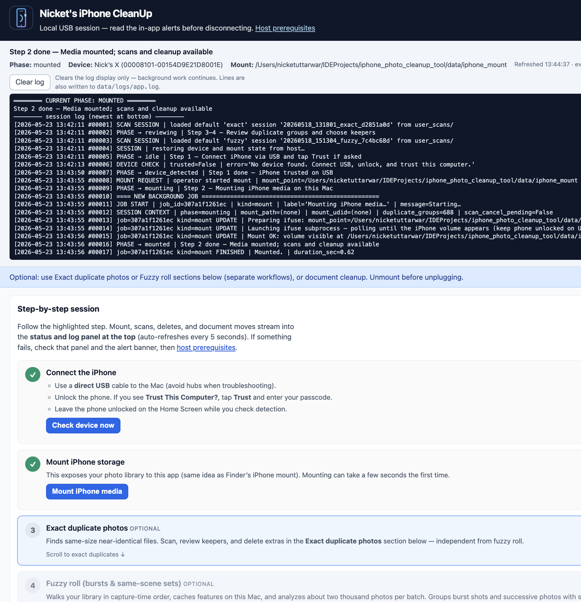
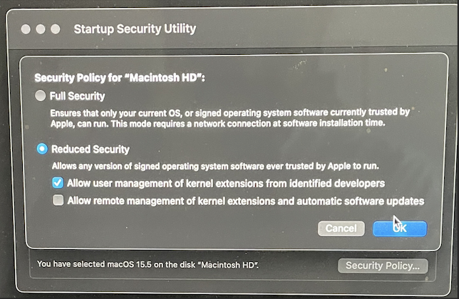
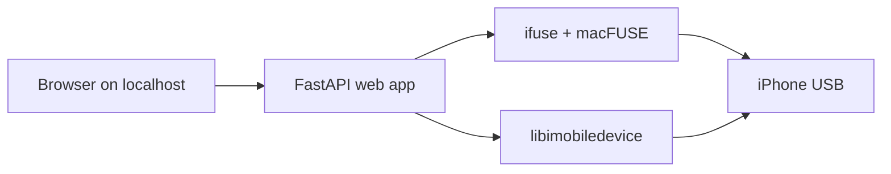

# Nicket's iPhone CleanUp

A **local web app** you run on a **Mac** with an **iPhone connected over USB**. It mounts your phone's media library, finds duplicate and similar photos, and lets you review and delete safely — with clear guidance for mount, scan, delete, and unmount.



The UI walks you through each step: connect → mount → scan → review → delete → unmount. Live status and an activity log stream at the top of the page; structured logs also go to `data/logs/app.log`.

---

## What it does

| Workflow | Description |
|----------|-------------|
| **Exact duplicates** | Finds same-size, near-identical files (perceptual hash + size bucketing). Auto-ranks keepers by sharpness, resolution, and recency. |
| **Fuzzy roll** | Groups burst shots and same-scene photos in capture-time order (palette, layout, and hash similarity). |
| **Document-style photos** | Finds receipts/scans (tags, path hints, optional white-paper heuristic). Copies to the Mac first so you can undo until unmount. |
| **Safe session lifecycle** | Detects the device, mounts via ifuse, scans in the background, confirms bulk deletes, and **unmounts on shutdown** so you do not leave a FUSE mount dangling. |

Duplicate groups start with **auto-ranked keepers**. Tap thumbnails to override keep marks before deleting extras.

---

## Requirements

### Hardware & OS

- **Mac** — developed and tested on **Apple Silicon** (M-series). Intel Macs are untested.
- **iPhone** + **direct USB cable** (avoid hubs when troubleshooting).
- **macOS** with permission to install kernel extensions (see below).

### Host tools (system-installed, not from pip)

| Tool | Purpose |
|------|---------|
| [**macFUSE**](https://osxfuse.github.io) | FUSE support on macOS; required by ifuse. |
| [**libimobiledevice**](https://github.com/libimobiledevice/libimobiledevice) | USB pairing — `ideviceinfo`, `idevice_id`. |
| [**ifuse**](https://github.com/libimobiledevice/ifuse) | Mounts the iPhone **Media** tree into a local folder. |
| **usbmuxd** | Usually bundled with libimobiledevice; must be running for USB. |

Run `./scripts/check_host_prerequisites.sh` for a soft check and Homebrew install hints.

### Python

- **Python 3.9+** (the launcher script creates `.venv/` automatically).

---

## Apple Silicon: kernel extension permissions (macFUSE)

**macFUSE** uses a kernel extension. On Macs with **Apple silicon**, you cannot fully enable this from normal macOS the first time — you must boot into **macOS Recovery** and change the startup security policy.

### Steps

1. Shut down the Mac.
2. Boot into **Recovery** (hold the power button until *Loading startup options*, then choose **Options**).
3. Open **Utilities → Startup Security Utility**.
4. Select your startup volume (e.g. **Macintosh HD**).
5. Click **Security Policy…**
6. Choose **Reduced Security**.
7. Check **Allow user management of kernel extensions from identified developers**.
8. Click **OK**, then restart from the Apple menu.



After reboot:

- Install or update **macFUSE** if you have not already (`brew install --cask macfuse`).
- Approve any remaining prompts in **System Settings → Privacy & Security** per the installer.
- Expect at least **one full reboot** after the Recovery change before FUSE/ifuse works reliably.

**Reference walkthrough:** [Kernel extensions on Mac with Apple silicon (Sweetwater)](https://www.sweetwater.com/sweetcare/articles/kernel-extensions-on-mac-with-apple-silicon)

If mount fails with kext or permission errors, finish Recovery + reboot + System Settings approvals, then run `./scripts/check_host_prerequisites.sh` again.

---

## Quick start

```bash
git clone <this-repo> iphone_photo_cleanup_tool
cd iphone_photo_cleanup_tool

# Optional: copy and edit local overrides
cp config/app.example.yaml config/app.local.yaml

./scripts/run.sh
```

By default the app opens **http://127.0.0.1:8765/** in your browser.

### Session checklist

1. **Connect** — Unlock the iPhone; tap **Trust This Computer** if prompted.
2. **Check device** — Use the in-app button; confirm the device appears in the status bar.
3. **Mount** — Exposes the photo library (same idea as Finder's iPhone mount).
4. **Scan** — Run exact duplicate and/or fuzzy roll scans (optional, independent workflows).
5. **Review & delete** — Open review dialogs; confirm deletions in the two-step confirmation flow.
6. **Unmount** — **Before unplugging USB**, click **Unmount (safe)**. The app also unmounts on quit.

In-app help: **[Host prerequisites](http://127.0.0.1:8765/prerequisites)** (also linked from the header).

---

## Configuration

All settings come from **YAML config** and CLI flags. The app does **not** read environment variables for configuration.

| File | Role |
|------|------|
| `config/app.defaults.yaml` | Checked-in defaults |
| `config/app.example.yaml` | Template for local overrides |
| `config/app.local.yaml` | Your overrides (gitignored) — copy from example |
| `config/secrets.example.yaml` | Optional API keys template (gitignored when copied) |

Common overrides in `config/app.local.yaml`:

```yaml
server:
  port: 8765

ui:
  open_browser: false

duplicates:
  auto_best:
    face_eye: true   # requires requirements-mediapipe.txt
```

Set `tools.ideviceinfo`, `tools.idevice_id`, or `tools.ifuse` to absolute paths if they are not on `PATH`.

**Logs:** `data/logs/app.log` (or `paths.logs_dir` in YAML).

---

## Scripts

Run from the repository root.

### `./scripts/run.sh`

Creates or reuses `.venv/`, installs Python deps, runs host prerequisite checks, and starts the app.

```bash
./scripts/run.sh
./scripts/run.sh --no-open-browser
./scripts/run.sh --skip-host-check
./scripts/run.sh --dev                    # also installs pytest, httpx, etc.
./scripts/run.sh --config ./config/app.local.yaml
./scripts/run.sh --recreate-venv
./scripts/run.sh --python /usr/local/bin/python3
```

### `./scripts/check_host_prerequisites.sh`

Prints `[host-check]` warnings when `ideviceinfo`, `idevice_id`, `ifuse`, or `diskutil` are missing. Always exits 0.

### `./scripts/sanity.sh`

Runs pytest and a short live HTTP smoke test on an ephemeral port.

```bash
./scripts/sanity.sh
./scripts/sanity.sh --skip-live
```

### Direct Python entry

```bash
.venv/bin/python -m iphone_cleanup \
  --repo-root . \
  --defaults-config config/app.defaults.yaml \
  --local-config config/app.local.yaml
```

---

## Optional: face/eye assist for auto “best” picks

Install MediaPipe into the same venv, then enable in config:

```bash
.venv/bin/pip install -r requirements-mediapipe.txt
```

```yaml
# config/app.local.yaml
duplicates:
  auto_best:
    face_eye: true
```

Fuzzy sets then favor approximate eye counts when ranking keepers.

---

## Project layout

```text
iphone_photo_cleanup_tool/
├── README.md                 ← you are here
├── config/                   # YAML defaults and local overrides
├── docs/                     # architecture, workflows, components
├── scripts/                  # run.sh, host checks, sanity
├── src/iphone_cleanup/       # FastAPI app, scan engine, UI static files
│   ├── api/                  # REST + SSE routes
│   ├── static/               # app.css, app.js
│   └── templates/            # index.html, prerequisites.html
├── tests/                    # pytest suite
├── user_scans/               # saved scan sessions (runtime data gitignored)
├── data/                     # mount point, logs, caches (gitignored)
├── screenshot_of_app.png
└── image_of_kernel_permission_step.png
```

**Saved scans** live under `user_scans/sessions/<session_id>/` — see [user_scans/README.md](user_scans/README.md).

---

## How it works (stack)



1. **libimobiledevice** talks USB (trust, device metadata).
2. **ifuse** + **macFUSE** mount `paths.mount_point` (default `data/iphone_mount`).
3. The **Python app** walks the mount, hashes images, groups duplicates, serves thumbnails, and deletes in chunks to reduce FUSE pressure.
4. On shutdown, the app **unmounts** and terminates the ifuse subprocess.

Deep-dive documentation: **[docs/README.md](docs/README.md)**.

---

## Development

```bash
./scripts/run.sh --dev
.venv/bin/python -m pytest tests/ -q
./scripts/sanity.sh
```

Dev dependencies are declared in `pyproject.toml` under `[project.optional-dependencies] dev`.

---

## Known limitations

### Ghost thumbnails after delete

Deleting photos **through the mounted filesystem** removes files but may **not update** the iPhone Photos database. The native Photos app can show **ghost thumbnails** until the phone re-indexes.

**Mitigation:** After bulk deletes, **restart the iPhone** once, then open Photos and confirm. See [docs/workflows/post-delete-restart.md](docs/workflows/post-delete-restart.md).

### Scope assumptions

- **One phone / one mount** per app session.
- **Localhost-only** web UI in v1 (no remote access or multi-user auth).
- **File-level delete** tradeoff vs perfect Photos-app consistency (documented above).
- **dupeGuru** integration remains optional; the in-repo scanner covers v1 duplicate groups.

---

## Troubleshooting

| Symptom | What to try |
|---------|-------------|
| Mount fails / kext errors | Complete [kernel extension setup](#apple-silicon-kernel-extension-permissions-macfuse) and reboot. |
| Device not detected | Unlock phone, re-trust, use a direct cable, confirm `ideviceinfo` works in Terminal. |
| Port already in use | Change `server.port` in `config/app.local.yaml` or stop the other process (`lsof -nP -iTCP:8765 -sTCP:LISTEN`). |
| Missing binaries | Run `./scripts/check_host_prerequisites.sh` and install suggested Homebrew packages. |
| Unmount fails | Close Finder windows on the iPhone volume; retry **Unmount** in the app. |

---

## Further reading

| Topic | Location |
|-------|----------|
| Documentation map | [docs/README.md](docs/README.md) |
| First-run setup | [docs/workflows/first-run-setup.md](docs/workflows/first-run-setup.md) |
| End-to-end session | [docs/workflows/wired-cleanup-session.md](docs/workflows/wired-cleanup-session.md) |
| Safe unmount | [docs/workflows/safe-unmount.md](docs/workflows/safe-unmount.md) |
| Upstream tool links | [docs/reference/links-and-sources.md](docs/reference/links-and-sources.md) |
| Multi-phone / cloud context (optional) | [multi-phone-one-acct-strategy.txt](multi-phone-one-acct-strategy.txt) |

---

## License

See repository license file if present; otherwise treat as private/local tooling unless stated otherwise.
