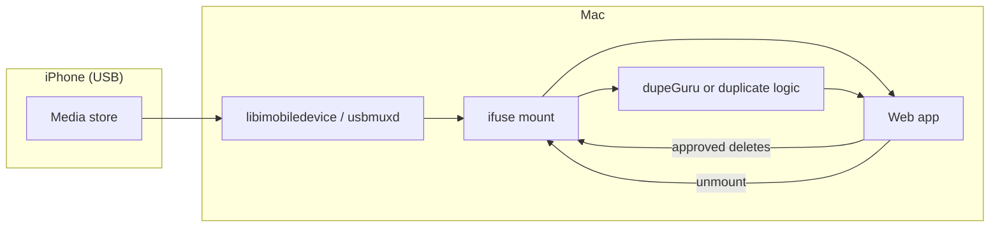

# Data flow

This document describes how **bytes and metadata** move through the system. Implementation can vary; the **stages** should stay stable so components and pipelines stay composable.

## High-level flow

## Typical session sequence

1. **Detect device** — `ideviceinfo` (or equivalent) confirms trust and identifiers.
2. **Mount** — ifuse exposes a path such as a dedicated mountpoint under the user’s home or `/Volumes`.
3. **Index / scan** — Walk mount or invoke dupeGuru with paths under the mount.
4. **Present** — Web UI lists groups, previews, sizes, paths; operator selects keep/delete.
5. **Execute** — Deletes run against **mounted filesystem paths** (not raw USB block I/O).
6. **Unmount** — FUSE teardown before cable disconnect.
7. **Post-op** — Optional reminder: iPhone restart if Photos shows ghosts ([workflows/post-delete-restart.md](../workflows/post-delete-restart.md)).

## Optional external augmentation

If enabled, the web app may call external APIs **after** reading keys from a **local config file** only — never checked into git. Flow: **local scan remains source of truth**; cloud calls add labels or cross-device hints. See [integration/optional-external-services.md](../integration/optional-external-services.md).

## Related

- [pipelines/scan-and-review-pipeline.md](../pipelines/scan-and-review-pipeline.md)
- [components/README.md](../components/README.md)
