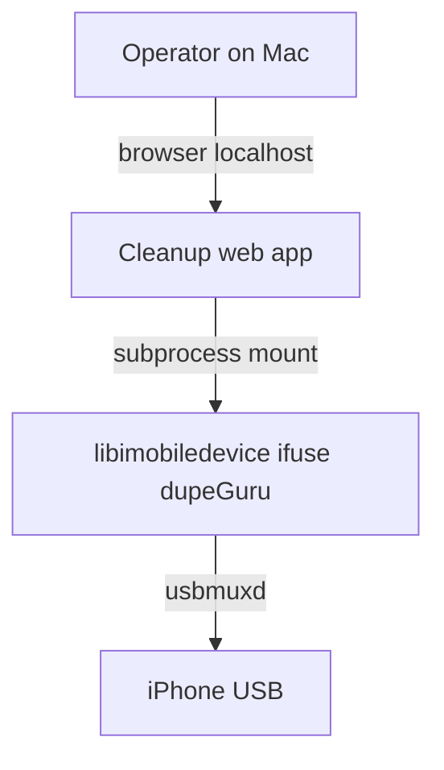

# System context

## Goal

Deliver a **web-based, functional, interactive** application runnable on a **MacBook Pro (Apple Silicon)** that helps **clear photo (and related) assets** from an **iPhone connected via USB cable**, using local tools rather than iTunes or Apple Photos as the primary interface.

## Actors

- **Human operator** — Runs the app on the Mac, approves deletions, unmounts safely.
- **Web application** — Local HTTP server + UI; orchestrates mounts, scans, and actions.
- **iPhone** — USB client; exposes media through protocols implemented by libimobiledevice and mounted via ifuse.
- **Host OS** — macOS with macFUSE kernel support where required.

## Constraints

- **Apple Silicon / macFUSE** — Kernel extension policy may require Recovery-mode “Reduced Security”; document in setup ([workflows/first-run-setup.md](../workflows/first-run-setup.md)).
- **Direct file deletion** — May desync iOS Photos database until re-index; document restart step ([workflows/post-delete-restart.md](../workflows/post-delete-restart.md)).
- **Security** — The app runs with host privileges sufficient to mount FUSE and spawn CLIs; minimize attack surface (local bind, auth if exposed beyond localhost).

## Context diagram (conceptual)

## Related

- [data-flow.md](./data-flow.md)
- [best-for-brett.md](../best-for-brett.md)
- [orchestration/local-runtime.md](../orchestration/local-runtime.md)
