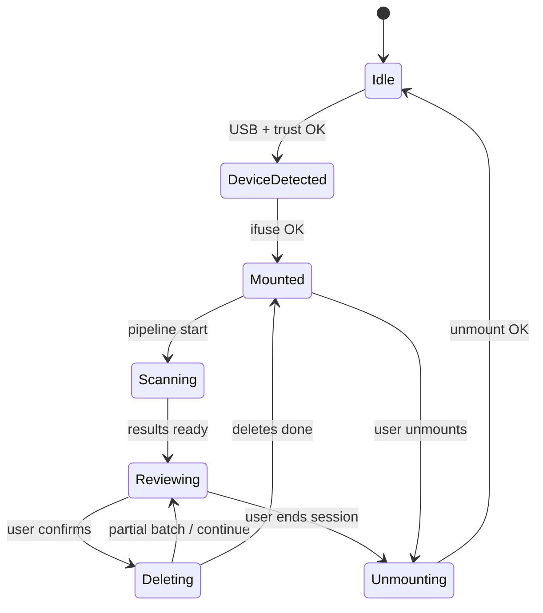

# Orchestration: local runtime

## Goal

Run a **local web server** on the Mac that:

- Serves the interactive UI.
- Spawns and supervises **libimobiledevice**, **ifuse**, and **dupeGuru** (or equivalents).
- Maintains a **single session state machine**: idle → device_detected → mounted → scanning → reviewing → deleting → unmounted.

## Suggested state machine

## Concurrency

- **One active mount** per app instance unless you explicitly design multi-device (advanced).
- Long scans run in a **worker** (thread/process) with cancellation support.

## Observability

- Structured logs per job id: mount, scan, delete, unmount.
- Surface last error string to UI for supportability.

## Related

- [../components/web-viewer.md](../components/web-viewer.md)
- [../workflows/wired-cleanup-session.md](../workflows/wired-cleanup-session.md)
