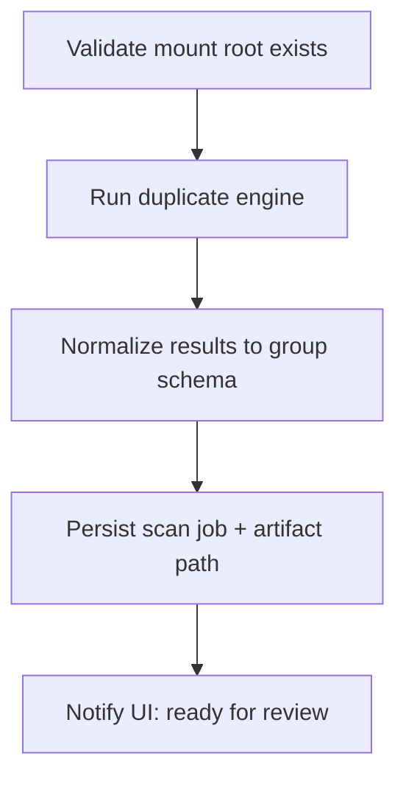

# Pipeline: scan and review

**Goal:** From a **mounted** iPhone Media tree, produce **duplicate groups** and load them into the web viewer for human decisions.

## Stages

## Inputs

- `mountPath` (absolute, under ifuse)
- Optional scan profile (hash-only vs visual similarity — product decision)

## Outputs

- In-memory or on-disk **scan artifact** (JSON/SQLite) consumed by [../components/web-viewer.md](../components/web-viewer.md))
- Job metadata: started/finished, counts, errors

## Error handling

- Mount disappeared mid-scan → abort with clear state; require remount.
- Partial read errors → mark files skipped; do not fail entire job silently.

## Related

- [../components/duplicate-engine.md](../components/duplicate-engine.md)
- [../workflows/wired-cleanup-session.md](../workflows/wired-cleanup-session.md)
